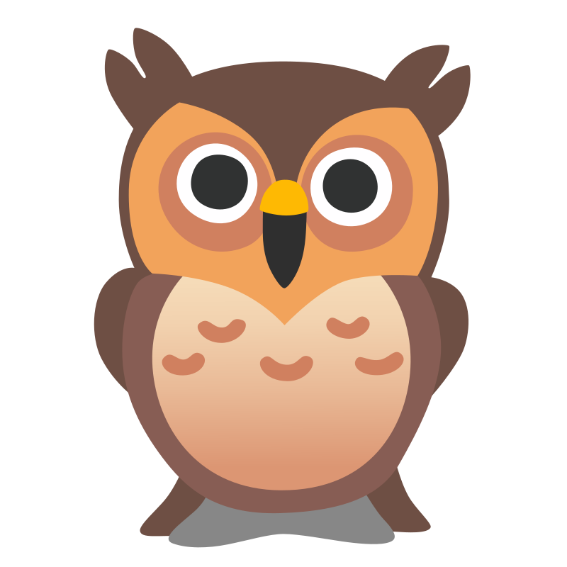
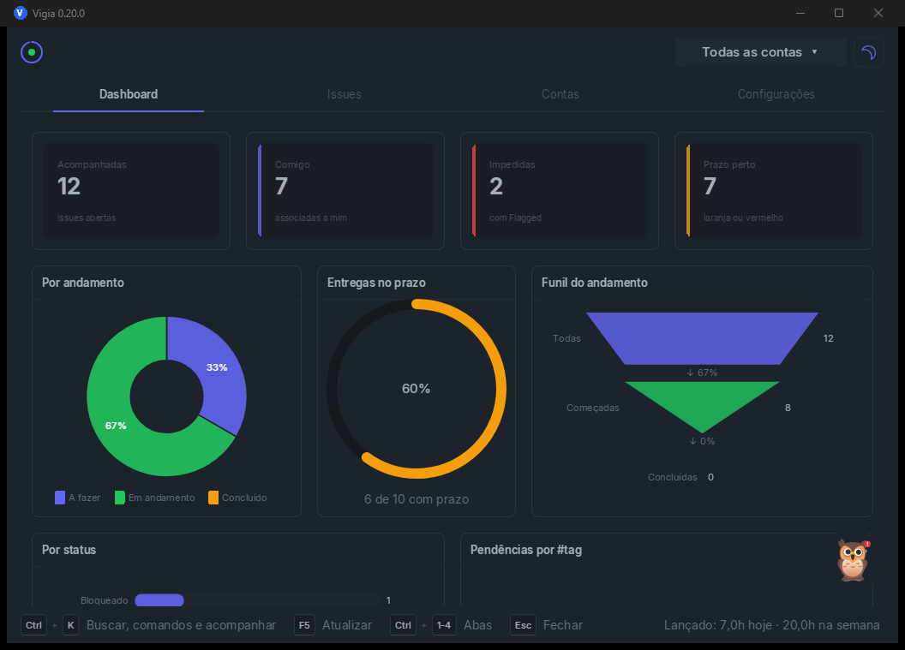
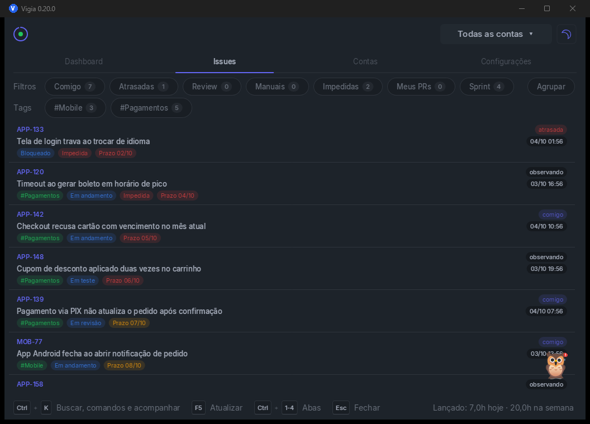
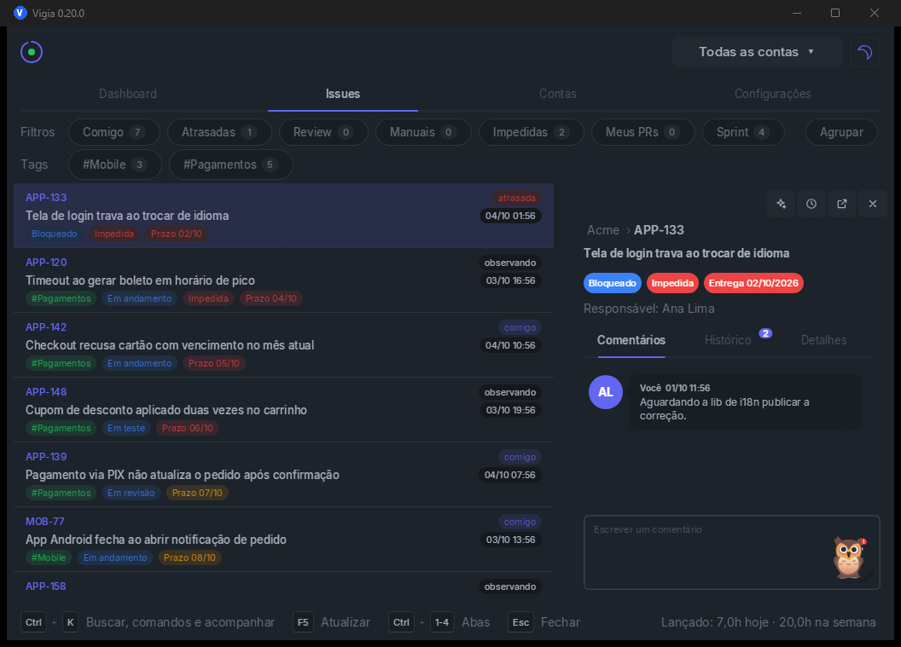
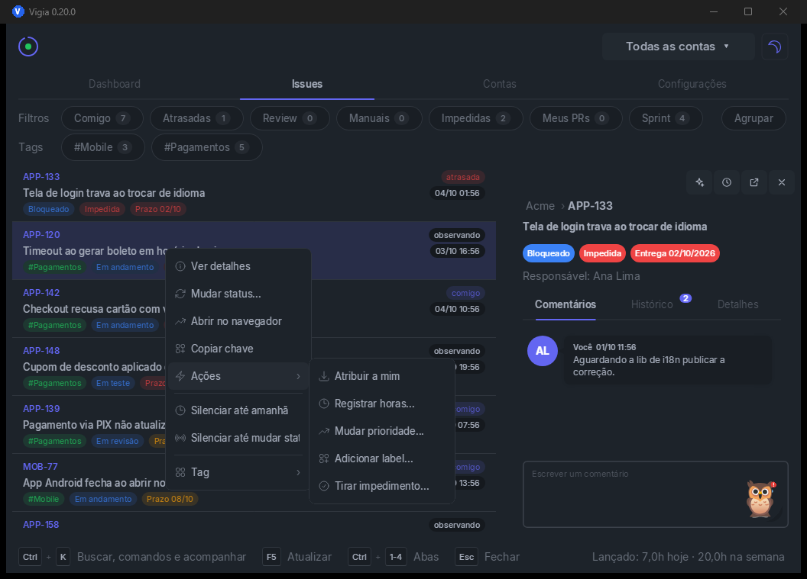
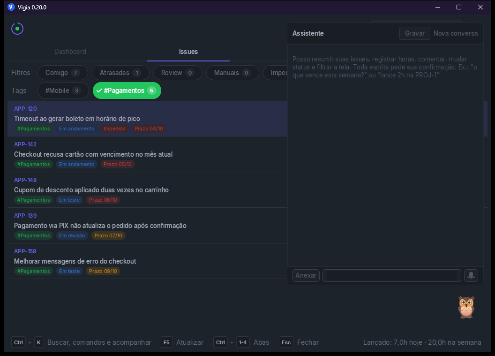
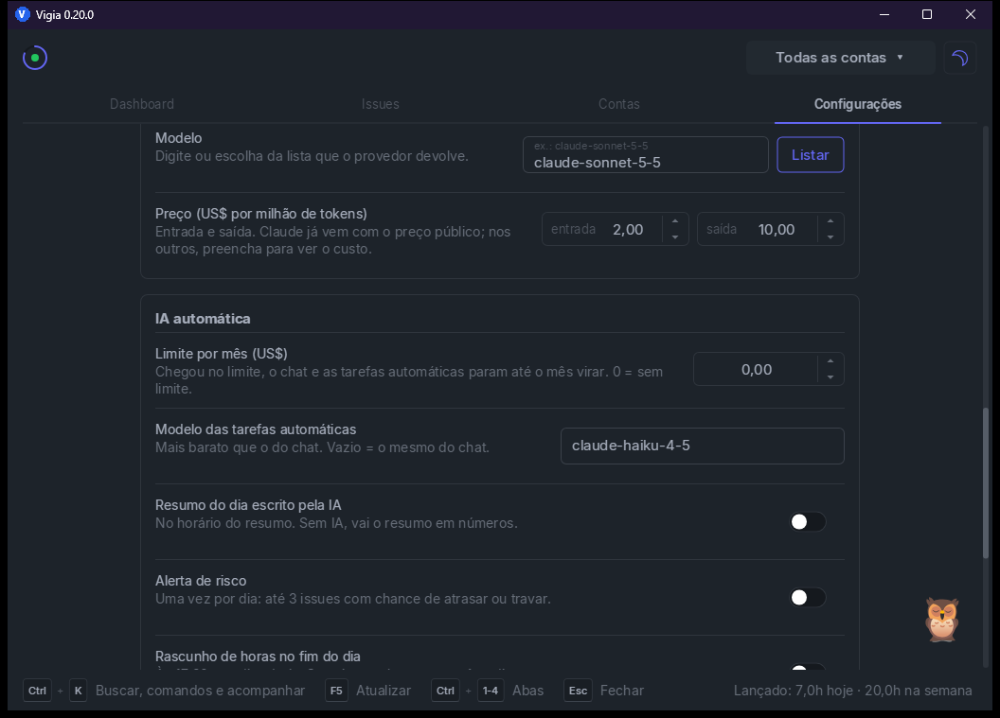
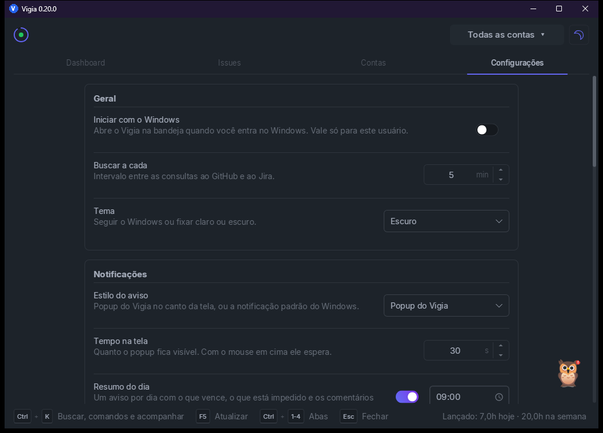
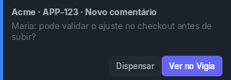

<p align="center">
  
</p>

<h1 align="center">Vigia</h1>

<p align="center">
  <b>Your GitHub and Jira issues in the Windows tray.</b><br>
  It tells you what changed, shows what is due, and lets you act without opening the browser.
</p>

<p align="center">
  <a href="https://github.com/herlondf/vigia/releases/latest"></a>
  
  
  
</p>

<p align="center">
  
</p>

> The app UI is in Brazilian Portuguese. Screenshots below show it as is.

---

## Why

- **One place.** GitHub, Jira Server/DC and Jira Cloud, as many accounts as you need.
- **Alerts that matter.** Assigned, comment, mention, status, due date, review, PR approved, red CI. You choose per account.
- **Act right there.** Comment, log work, change status, assign, flag an impediment. Always with confirmation.
- **AI assistant.** Ask "what is due this week?" or say "log 2h on PROJ-1".
- **Safe.** Tokens live in the Windows Credential Manager. Never in files or the database.

## Tour

<table>
  <tr>
    <td width="50%"></td>
    <td width="50%"></td>
  </tr>
  <tr>
    <td><b>Issues</b>: quick filters, your own tags, grouping by repository or project.</td>
    <td><b>Issue panel</b>: comments, alert history and details, inside the app.</td>
  </tr>
  <tr>
    <td></td>
    <td></td>
  </tr>
  <tr>
    <td><b>Actions</b>: assign, label, approve PR, priority, impediment.</td>
    <td><b>Assistant</b>: answers about your issues and runs actions with your permission.</td>
  </tr>
  <tr>
    <td></td>
    <td></td>
  </tr>
  <tr>
    <td><b>Automatic AI</b> (optional): daily summary, risks, worklog draft, CI failure cause. With a spending cap.</td>
    <td><b>Settings</b>: polling interval, theme, alert style, do not disturb.</td>
  </tr>
</table>

<p align="center">
  <br>
  <sub>Alerts show up in the screen corner. "Ver no Vigia" opens the issue.</sub>
</p>

## Install

1. Download `Vigia-Setup-<version>.exe` from the [latest release](https://github.com/herlondf/vigia/releases/latest).
2. Run it. It installs for your user only and does not ask for admin rights.
3. Open Vigia from the Start menu and add an account in **Contas › Nova conta**.

Step by step for each provider: [playbook](docs/playbook/en/README.md).

## Build from source

> **Note:** Vigia uses the [ComponentesUI](https://github.com/herlondf/componentesui) component suite, which is currently **private**. Without access to it you cannot build. The release installer works for anyone.

Requires RAD Studio 12 (Studio 22.0), ComponentesUI and Inno Setup 6. ComponentesUI is looked up at `..\Delphi\ComponentesUI`. For another place, set `VIGIA_CUI` or pass `-CuiRoot`.

```powershell
pwsh ci/build-release.ps1      # Release + self-check + dist\Vigia-Setup-<version>.exe
```

In the IDE: open `src\Vigia.dproj`. The suite path is the project's `CUI` property.

GitHub release: `pwsh ci/release.ps1`. It starts the self-hosted runner, creates the tag, waits for the workflow to publish and stops the runner.

## Documentation

| | |
|---|---|
| [Playbook](docs/playbook/en/README.md) | Manual: install, set up accounts, daily use, assistant, troubleshooting |
| [CHANGELOG](docs/CHANGELOG.md) | What changed in each version (Portuguese) |

<p align="center"><sub>Mascot based on the owl from <a href="https://github.com/googlefonts/noto-emoji">Noto Emoji</a> (Google, Apache 2.0).</sub></p>

---

<p align="center"><sub>🇧🇷 Leia em português: <a href="README.md">README.md</a></sub></p>
